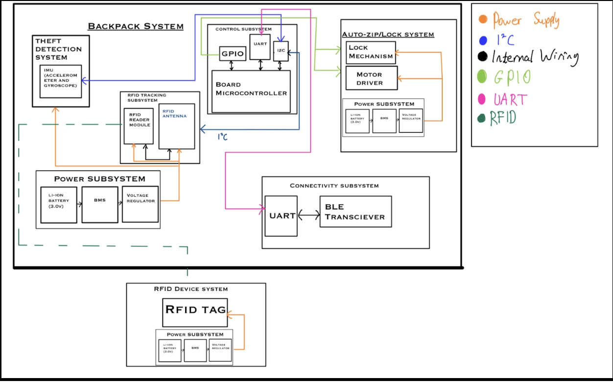

# Aashish's Work Log

* [February 06, 2025 - Idea Finalization](#entry0)
* [February 13, 2025 - Product Expansion](#entry1)
* [February 16, 2025 - Design Review Preparation](#entry2)
* [February 24, 2025 - Planning PCB Design](#entry3)
* [March 3, 2025 - Teamwork Evaluation and Design Doc Work](#entry4)
* [March 10, 2025 - Implementing Basic RFID](#entry5)
* [March 11, 2025 - Finding Bugs and Breadboard Demo](#entry6)
* [March 12, 2025 - Second PCB](#entry7)
* [March 13, 2025 - Continuing Work on PCB](#entry8)
* [April 4, 2025 - Debugging 2nd Round PCB](#entry9)
* [April 7, 2025 - Debugging the 4th PCB](#entry10)
* [April 15, 2025 - Initial Backpack Design](#entry11)
* [April 25, 2025 - Yarn for Backpack](#entry12)
* [April 26, 2025 - PCB Soldering with Seth](#entry13)
* [April 27, 2025 - More Work on Backpack](#entry14)
* [April 28, 2025 - Replacing the Yarn](#entry15)
* [April 29, 2025 - Demo Day](#entry16)
* [April 29, 2025 - Post Demo](#entry17)
* [April 30, 2025 - Final Report Outline](#entry18)
* [May 3, 2025 - Results & Discussion Draft](#entry19)
* [May 6, 2025 - Conclusion & Revision](#entry20)
* [May 7, 2025 - Final Touches](#entry21)
* [May 8, 2025 - Lab Check-Out & Wrap-Up](#entry22)

## February 06, 2025 - Idea Finalization <a name="entry0"></a>
After individually brainstorming, we met up as a group to pool our ideas and narrow down our options in order to complete an RFA (request for approval) for our project. We decided on a micro-controller based project that would double as a backpack item tracker to prevent losing or leaving behind the contents of one's backpack and act as an anti-theft device. This device would utilize RFID technology to keep track of items and a gyroscope based system that would be used to detect if the backpack is being moved. Criteria for Success Accurate RFID Tracking: The system must reliably detect and track RFID-tagged items in real-time, alerting users when an item is missing. 
\
\
The decided upon criterion for success:
- Effective Theft Detection: The IMU sensors should correctly identify unauthorized movements and trigger alerts or alarms.
- Seamless Mobile App Integration: The app should provide real-time inventory tracking, geofencing alerts, and security notifications.
- Reliable Auto-Zip & Locking Mechanism: The motorized zippers and locks must function consistently and respond correctly to user-defined security settings.

## February 13, 2025 - Product Expansion <a name="entry1"></a>
Today's focus was on the completion of a full project proposal document. We decided to go with the name "Backtracker" while also solidifying the subsystems we would be implementing: accurate RFID based item tracking, gyroscope based anti-theft measures, and an auto-zip and auto-locking mechanism. These subsystems were expanded upon what is necessary for each subsystem. This document also has a more official, in depth problem and solution statement. [Project Proposal Doc Link](https://docs.google.com/document/d/1oT1uViF3huYhxj1f5n7ijpcLWG28EtPaLmi4j_PiVDU/edit?tab=t.0)
\
\


## February 16, 2025 - Design Review Preparation <a name="entry2"></a>
We fleshed out some details on our design in order to present it to the TA and professor for feedback. We have narrowed down our choice of micro-controller to an ESP32 or STM32 and will need to do further analysis. We have also found potential parts for the RFID antenna: ARRUN5-915.000MHZ and MFRC52202HN1,151, of which again further analysis will be needed. We also decided to go with HF (high frequency) RFID tags and transmitter, which operate at 13.56 MHz in order to cover the necessary range to detect items in a backpack.

## February 24, 2025 - Planning PCB Design <a name="entry3"></a>
Our group met up and began discussing the specifics of how we were going to implement the design of each of our three subsystems. The RFID system and the accelerometer/gyroscope system seem to have a straightforward path ahead of designing the circuit since the conceptual functions have been decided upon. Most of our focus was on the automatic zipper subsystem, which seems like it will be the most difficult. We came up with a couple potential ways to implement this, however an outright zipper system may be too complicated and we may have to do automatic backpack closing via a different method.
Currently, the most promising ideas are to have a motorized spool with higher torque attached to one side of the zipper and then have the cable anchored to the other side of the zipper so that when the backpack is open and the front is folded over, the spool can pull the backpack together to make it easier to seal.
Sealing with the zipper may be hard, so we came up with the idea to use magnetic fasteners, perhaps in conjunction with a latching mechanism. However this needs to be fleshed out.
\
\
To do next time:
- Pick out specific parts
- Begin PCB design
- Design subsystem circuits
- Decide on a microcontroller

## March 3, 2025 - Teamwork Evaluation and Design Doc work <a name="entry4"></a>
Our group met up on to work on the teamwork evaluation that was due today and we also made progress towards the design doc. Today, I worked on putting in the introduction section into it. Additonally, I worked on fleshing out some more ideas for the requirements and verifications section for most of the subsystems. I also worked with Shreyas on getting the parts list and schedule more organized. Lastly, I worked on getting the ethics sections finished up.

## March 10, 2025 - Implementing Basic RFID <a name="entry5"></a>
We worked on different parts of the project to get the basic functionality of some of our subsystems. The RFID system was original setup on an Arduino UNO for testing purposes, and once the read/write functionality was developed, the RFID antenna was rewired to connect to pins on the ESP32 microcontroller that we will be using for our final PCB. After the needed device drivers were installed, the Arduino IDE was suitable to upload the code to the ESP32. The RFID system ended up having the ability to read any RFID tag in the vicinity, and once the user input a value into the Arduino IDE terminal, the system entered write mode, which then writes the string to the next passive RFID tag that comes into the range of the antenna before going back into read only mode. This can happen for any number of passive high-frequency RFID tags.
\
\


## March 11, 2025 - Finding Bugs in Current Implementation and Breadboard Demo <a name="entry6"></a>
After the bluetooth functionality prototype was integrated with the RFID code, the breadboard prototype was put to the test to explain some functionality, and we realized that there were some bugs that need to be fixed with the bluetooth and some functionality added to the RFID system. The bluetooth seems to run on a delay or not receive the signal when it's around other microcontrollers, and we suspect it has something to do with the bluetooth being a specific low powered version called Bluetooth Low Energy (BLE). The RFID system needs a way to become attached to different objects, we are thinking about implementing another tag and/or reader in order to also detect if the backpack is closed or open, which will be good information for our other subsytems. Plus we need to figure out where to put the RFID reader to make up for the range, because if the RFID antenna is at the bottom of the backpack, it cannot reach all the tags. 
We also had our breadboard demo today which went well. We were able to show off that the reader was able to distinguish between 2 different tags each with its own name. 

## March 12, 2025 - Second PCB <a name="entry7"></a>
Shreyas and I worked together on figuring out the PCB with KiCad. After going through more documention, we had a better idea of how the components connected together so we knew where to start. We got the Schematic set up and continued to work o the actual PCB schematic. We thought we got stuff figured out but encountered a lot of errors. One of them was not connected pins that we didn't know could cause errors. We sent it to our TA after finalizing stuff, but he said that we didn't pass the audit but it was a late so we continued to work on it the next day. 

## March 13, 2025 - Continuing work on PCB <a name="entry8"></a>
Completed base PCB, getting rid of errors. Since we haven’t hooked the IMU or motor driver up on a breadboard yet, we’re not 100% sure our ESP32‑to‑IMU and ESP32‑to‑motor connections are correct, and we’re worried we might’ve forgotten transistors or resistors for parts that need extra components. Progress felt slow and a bit uncertain, but we did our best to cross‑check pinouts and power rails before wrapping up. 
\
\


## April 4, 2025 - Debug 2nd Round PCB <a name="entry9"></a>
After we finished soldering all the resistors, capacitors, and the microcontroller onto the PCB, we realized we forgot to include the components needed to actually flash the board. To fix that, we started updating the schematic to add a JTAG UART/programmer so we could upload code to it. This is the part we were planning to use as the middleman.

## April 7, 2025 - Debugging the 4th PCB <a name="entry10"></a>
We realized we didn’t actually need to add that specific programmer to our KiCad design. Instead, we could just use one of the breakout programmers provided by 2070. After talking with a TA, we figured this was a safer option—less chance of us making a mistake that could stop us from being able to program the board. So, we just added the connector pins that matched the programmer we planned to use.

## April 15, 2025 - Starting designing the initial backpack <a name="entry11"></a>
I started to think more about the physical design of the backpack, trying to figure out how we were going to lift up the backpack, actually seeign if a zipper was even possible. We saw that the zipper was not the best option because there was no way for us to actually get the backpack arch to work. We decided on a latch system where the backpack was going to open and close the backpack. 

## April 25, 2025 - Yarn for backpack <a name="entry12"></a>
Shreyas had yarn in his apartment so I used that to my advantage and wrapped it around the motor that we would be using and attached it to the opposite side of the backpack. After a few fixes of getting it untangled, it was able to get it close the backpack while spinning the motor wheel. We had to still get the motor plugged in, but in terms of getting the motor "spinning" and closing a backpack, it was good!

## April 26, 2025 - PCB Soldering with Seth <a name="entry13"></a>
Seth and I went to ECEB today to solder our 4th PCB. We were trying a lot to understand how to use the stencil in order for us to apply the microcontroller and other components to the board but eventually we got it. We then put it into the oven to actually apply the microcontroller onto the PCB which was a really interesting process. Afterwards me and Seth continued to work on soldering the rest of the components to the PCB. 
\
\


## April 27, 2025 - More work on Physical Backpack <a name="entry14"></a>
We continued to work on the physical backpack, combining everything and attaching it to the backpack itself with the motor/yarn. We were able to get the backpack to fully close and open now but by shaking because of Shreyas's IMU but the yarn got really stuck because it was really thick. So we called it for the day and decided tomorrow to figure out another item to use to bring the backpack up. 
\
\


## April 28, 2025 - Replacing the yarn <a name="entry15"></a>
Seth and I met up to figure out what we can do to replace the yarn in the backpack and we decided to go to Green Street to find something. We were looking for something thin but strong enough to do the job. We went to Target and decided to use a metal cable, similar to it used to hang out paintings on the wall which is really thin but really strong. After replacing the yarn with this, we found much better sucess after a few tries. The issue we faced was that it would get tangled, but we found a work around by making the liner even thinner because it had some layers involved. After that, the backpack was ready to go! 
\
\


## April 29, 2025 - Demo Day <a name="entry16"></a>
Our ESP32 got corrupted when we were running it a few hours before demo. This is something I'm realizing after the fact when debugging and seeing why it went wrong. It started failing more and more frequently after the demo.

```
Backtrace: 0x400e15dc:0x3ffe3bf0 0x400e2886:0x3ffe3c10 0x40082882:0x3ffe3c40 0x40079772:0x3ffe3c90 |<-CORRUPTED


ELF file SHA256: 6cb894749

E (438) esp_core_dump_flash: Core dump flash config is corrupted! CRC=0x7bd5c66f instead of 0x0
E (447) esp_core_dump_elf: Elf write init failed!
E (451) esp_core_dump_common: Core dump write failed with error=-1
Rebooting...
```
THe ESP32 upon closer debugging, started spamming this message - which is why it was not working for a large portion of the time. We suspect that it was our 6.4V battery source used for a breakout board that was only designed to step down 5V for the ESP 32's target voltage of 3.3V. I realized that running too much voltage or current into my ESP32 likely fried either its tiny external flash chip or its onboard 3.3 V regulator. Those flash cells are delicate—one rogue spike can scramble entire sectors so the CPU ends up reading garbage. Or if the little LDO regulator overheats or latches up under a heavy draw, it can’t hold a steady 3.3 V and the resulting brown‑outs quietly corrupt RAM or flash writes mid‑operation. In both scenarios, bad data leads to invalid instructions and the repeated crashes we were wrestling with.


## April 29 2025 - Post Demo <a name="entry17"></a>
Exchanged the ESP32 with a new one and added an appropriate 5V power source, and it started functioning perfectly! Slightly frustrated because of what happened before the demo, but not the end of the world - got it working for the Extra Credit video. Was very fulfilling to work on this project and happy with my experience in the class.

## April 30 2025 – Final Report Outline <a name="entry18"></a>

Drafted the overall structure of the final report: outlined Introduction, Methods, Results, Discussion, and Conclusion sections. Collected all schematics and block diagrams into one folder, and started writing the Introduction with project motivation and scope.

## May 3 2025 – Results & Discussion Draft <a name="entry19"></a>

Completed the Results section: summarized sensor calibration data, motor torque tests, and Bluetooth connectivity logs. Began the Discussion subsection by interpreting the performance metrics and noting limitations encountered with the MPU‑6050 readings.

## May 6 2025 – Conclusion & Revision <a name="entry20"></a>

Wrote the Conclusion: reflected on design successes, key learnings, and potential future improvements (e.g., integrating a higher‑torque motor). Performed a comprehensive proofread, standardized figure captions, and ensured all citations were formatted correctly.

## May 7 2025 – Final Touches <a name="entry21"></a>

Added the Abstract and Executive Summary. Checked all formatting against the report template, updated table of contents, and inserted page numbers. Exported the document to PDF for submission.

## May 8 2025 – Lab Check‑Out & Wrap‑Up <a name="entry22"></a>

Completed lab check‑out procedures: cleaned and organized one lab desk, filled out the ICES feedback form, and returned the mini‑USB programmer to the equipment cabinet. Celebrated the end of the semester’s lab work!


