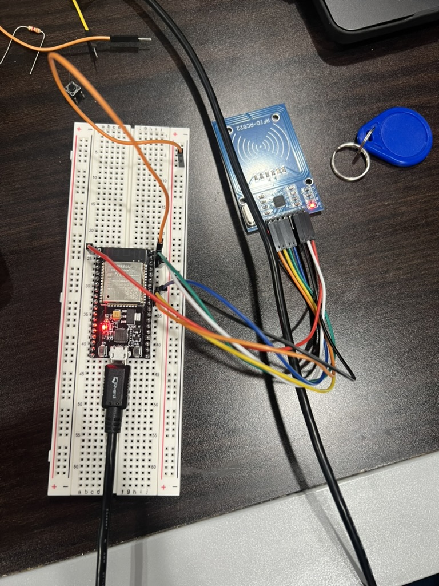

# Seth's Work Log

- [Feb. 06, 2025 - Idea Finalization](#entry0)
- [Feb. 13, 2025 - Product Expansion](#entry1)
- [Feb. 16, 2025 - Design Review Preparation](#entry2)
- [Feb. 24, 2025 - Planning PCB Design](#entry3)
- [Mar. 10, 2025 - Implementing Basic RFID](#entry4)
- [Mar. 11, 2025 - Finding Bugs in Current Implementation](#entry5)

## February 06, 2025 - Idea Finalization 
After individually brainstorming, we met up as a group to pool our ideas and narrow down our options in order to complete an RFA (request for approval) for our project. We decided on a micro-controller based project that would double as a backpack item tracker to prevent losing or leaving behind the contents of one's backpack and act as an anti-theft device. This device would utilize RFID technology to keep track of items and a gyroscope based system that would be used to detect if the backpack is being moved. Criteria for Success Accurate RFID Tracking: The system must reliably detect and track RFID-tagged items in real-time, alerting users when an item is missing. 
\
\
The decided upon criterion for success:
- Effective Theft Detection: The IMU sensors should correctly identify unauthorized movements and trigger alerts or alarms.
- Seamless Mobile App Integration: The app should provide real-time inventory tracking, geofencing alerts, and security notifications.
- Reliable Auto-Zip & Locking Mechanism: The motorized zippers and locks must function consistently and respond correctly to user-defined security settings.

## February 13, 2025 - Product Expansion 
Today's focus was on the completion of a full project proposal document. We decided to go with the name "Backtracker" while also solidifying the subsystems we would be implementing: accurate RFID based item tracking, gyroscope based anti-theft measures, and an auto-zip and auto-locking mechanism. These subsystems were expanded upon what is necessary for each subsystem. This document also has a more official, in depth problem and solution statement. [Project Proposal Doc Link](https://docs.google.com/document/d/1oT1uViF3huYhxj1f5n7ijpcLWG28EtPaLmi4j_PiVDU/edit?tab=t.0)
\
\

## February 16, 2025 - Design Review Preparation 
We fleshed out some details on our design in order to present it to the TA and professor for feedback. We have narrowed down our choice of micro-controller to an ESP32 or STM32 and will need to do further analysis. We have also found potential parts for the RFID antenna: ARRUN5-915.000MHZ and MFRC52202HN1,151, of which again further analysis will be needed. We also decided to go with HF (high frequency) RFID tags and transmitter, which operate at 13.56 MHz in order to cover the necessary range to detect items in a backpack.

## February 24, 2025 - Planning PCB Design 
Our group met up and began discussing the specifics of how we were going to implement the design of each of our three subsystems. The RFID system and the accelerometer/gyroscope system seem to have a straightforward path ahead of designing the circuit since the conceptual functions have been decided upon. Most of our focus was on the automatic zipper subsystem, which seems like it will be the most difficult. We came up with a couple potential ways to implement this, however an outright zipper system may be too complicated and we may have to do automatic backpack closing via a different method.
Currently, the most promising ideas are to have a motorized spool with higher torque attached to one side of the zipper and then have the cable anchored to the other side of the zipper so that when the backpack is open and the front is folded over, the spool can pull the backpack together to make it easier to seal.
Sealing with the zipper may be hard, so we came up with the idea to use magnetic fasteners, perhaps in conjunction with a latching mechanism. However this needs to be fleshed out.
\
\
To do next time:
- Pick out specific parts
- Begin PCB design
- Design subsystem circuits
- Decide on a microcontroller

## March 10, 2025 - Implementing Basic RFID 
We worked on different parts of the project to get the basic functionality of some of our subsystems. The RFID system was original setup on an Arduino UNO for testing purposes, and once the read/write functionality was developed, the RFID antenna was rewired to connect to pins on the ESP32 microcontroller that we will be using for our final PCB. After the needed device drivers were installed, the Arduino IDE was suitable to upload the code to the ESP32. The RFID system ended up having the ability to read any RFID tag in the vicinity, and once the user input a value into the Arduino IDE terminal, the system entered write mode, which then writes the string to the next passive RFID tag that comes into the range of the antenna before going back into read only mode. This can happen for any number of passive high-frequency RFID tags.
\
\

## March 11, 2025 - Finding Bugs in Current Implementation 
After the bluetooth functionality prototype was integrated with the RFID code, the breadboard prototype was put to the test to explain some functionality, and we realized that there were some bugs that need to be fixed with the bluetooth and some functionality added to the RFID system. The bluetooth seems to run on a delay or not receive the signal when it's around other microcontrollers, and we suspect it has something to do with the bluetooth being a specific low powered version called Bluetooth Low Energy (BLE). The RFID system needs a way to become attached to different objects, we are thinking about implementing another tag and/or reader in order to also detect if the backpack is closed or open, which will be good information for our other subsytems. Plus we need to figure out where to put the RFID reader to make up for the range, because if the RFID antenna is at the bottom of the backpack, it cannot reach all the tags.