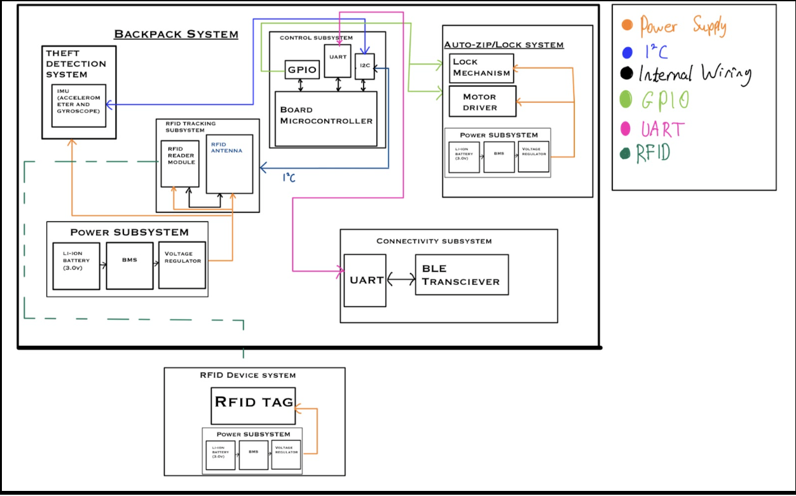

# Shreyas's Work Log
* [February 06, 2025 - Idea Finalization](#entry0)
* [February 13, 2025 - Product Expansion](#entry1)
* [February 16, 2025 - Design Review Preparation](#entry2)
* [February 24, 2025 - Planning PCB Design](#entry3)
* [February 28, 2025 - Microcontroller Finalization](#entry4)
* [March 06, 2025 - Bluetooth LE](#entry5)
* [March 08, 2025 - BLE Demo Connection to iPhone](#entry6)
* [March 09, 2025 - BLE Demo Connet to iPgone](#entry7)
* [March 10, 2025 - Setting up RFID with Bluetooth for Demo](#entry8)
* [March 12, 2025 - PCB 2nd Round Ordering Grind](#entry9)
* [March 13, 2025 - PCB 2nd Round Ordering Grind](#entry10)
* [April 01, 2025 - Working on IPR](#entry11)
* [April 04, 2025 - 2nd round PCB order debug](#entry12)
* [April 07, 2025 - PCB 4th order Debugging](#entry13)
* [April 19, 2025 - IMU](#entry14)
* [April 20, 2025 - IMU - Motor work part 2](#entry15)
* [April 21, 2025 - IMU - Motor work part 3](#entry16)
* [April 24, 2025 - Bluetooth - RFID](#entry17)
* [April 26, 2025 - Supplementary Two-way Bluetooth Interface](#entry18)
* [April 26, 2025 - Physical Backpack](#entry19)
* [April 27, 2025 - Physical Backpack 2](#entry20)
* [April 29, 2025 - Demo day](#entry21)
* [April 29, 2025 - Post Demo](#entry22)


## February 06, 2025 - Idea Finalization <a name="entry0"></a>
After individually brainstorming, we met up as a group to pool our ideas and narrow down our options in order to complete an RFA (request for approval) for our project. We decided on a micro-controller based project that would double as a backpack item tracker to prevent losing or leaving behind the contents of one's backpack and act as an anti-theft device. This device would utilize RFID technology to keep track of items and a gyroscope based system that would be used to detect if the backpack is being moved. Criteria for Success Accurate RFID Tracking: The system must reliably detect and track RFID-tagged items in real-time, alerting users when an item is missing. 
\
\
The decided upon criterion for success:
- Effective Theft Detection: The IMU sensors should correctly identify unauthorized movements and trigger alerts or alarms.
- Seamless Mobile App Integration: The app should provide real-time inventory tracking, geofencing alerts, and security notifications.
- Reliable Auto-Zip & Locking Mechanism: The motorized zippers and locks must function consistently and respond correctly to user-defined security settings.

## February 13, 2025 - Product Expansion <a name="entry1"></a>
Today's focus was on the completion of a full project proposal document. We decided to go with the name "Backtracker" while also solidifying the subsystems we would be implementing: accurate RFID based item tracking, gyroscope based anti-theft measures, and an auto-zip and auto-locking mechanism. These subsystems were expanded upon what is necessary for each subsystem. This document also has a more official, in depth problem and solution statement. [Project Proposal Doc Link](https://docs.google.com/document/d/1oT1uViF3huYhxj1f5n7ijpcLWG28EtPaLmi4j_PiVDU/edit?tab=t.0)
\
\


## February 16, 2025 - Design Review Preparation <a name="entry2"></a>
We fleshed out some details on our design in order to present it to the TA and professor for feedback. We have narrowed down our choice of micro-controller to an ESP32 or STM32 and will need to do further analysis. We have also found potential parts for the RFID antenna: ARRUN5-915.000MHZ and MFRC52202HN1,151, of which again further analysis will be needed. We also decided to go with HF (high frequency) RFID tags and transmitter, which operate at 13.56 MHz in order to cover the necessary range to detect items in a backpack.

## February 24, 2025 - Planning PCB Design <a name="entry3"></a>
Our group met up and began discussing the specifics of how we were going to implement the design of each of our three subsystems. The RFID system and the accelerometer/gyroscope system seem to have a straightforward path ahead of designing the circuit since the conceptual functions have been decided upon. Most of our focus was on the automatic zipper subsystem, which seems like it will be the most difficult. We came up with a couple potential ways to implement this, however an outright zipper system may be too complicated and we may have to do automatic backpack closing via a different method.
Currently, the most promising ideas are to have a motorized spool with higher torque attached to one side of the zipper and then have the cable anchored to the other side of the zipper so that when the backpack is open and the front is folded over, the spool can pull the backpack together to make it easier to seal.
Sealing with the zipper may be hard, so we came up with the idea to use magnetic fasteners, perhaps in conjunction with a latching mechanism. However this needs to be fleshed out.


## February 28, 2025 – Microcontroller Finalization <a name="entry4"></a>
Chose the ESP32‑WROOM‑32D for its ready availability and onboard Bluetooth, eliminating the need for a separate transceiver. Bo


## March 6, 2025 - Bluetooth LE <a name="entry5"></a>

Notes on bluetooh for ESP32:

  Bluetooth Stack - ESP32 uses BLUEDROID to imple,ment the layers of Bluetooth Protocol

  Bluetooth profiles that we plan on using - GAP, Generic Access Profile, Device Discovery, Connections & SEcurity

  Bluetooth Protocols:
    L2CAP - Logical Link control and Adpatation
    Organizes Bluetooth Traffic
    Dataa Transmission

    SDP - Service  
  

\
\
To do next time:
- Pick out specific parts
- Begin PCB design
- Design subsystem circuits
- Decide on a microcontroller


## March 8, 2025 – BLE Demo Connection to iPhone <a name="entry6"></a>

I followed the Random Nerd Tutorials guide on ESP32 BLE (https://randomnerdtutorials.com/esp32-bluetooth-low-energy-ble-arduino-ide/) and got my ESP32 talking to my iPhone.
Dove into BLE basics and discovered that Bluetooth Low Energy is designed for short bursts of small‑data transfers, spending most of its time asleep to conserve power—unlike classic Bluetooth, BLE only wakes when a connection’s initiated. configured the ESP32 as a BLE server advertising a custom 128‑bit service UUID with a single READ/WRITE characteristic, and used nRF Connect on my iPhone as the client to scan for “MyESP32” and establish the link. 


## March 9, 2025 – BLE Demo Connection to iPhone 2 <a name="entry7"></a>
I'm able to send intentional 'pings' of sort - but im not too sure how to receive actual messages. I think they're being sent but I don't know exactly how to read it on my phone. I also think that I should be able to add some functionality where my phone sends information to the ESP as well.  The following is the general code I produced with a lot of help from the guide.
```
#include <SPI.h>
#include <BLEDevice.h>
#include <BLEUtils.h>
#include <BLEServer.h>
#include <BLE2902.h>

// -------------------- BLE Setup --------------------
#define SERVICE_UUID        "4fafc201-1fb5-459e-8fcc-c5c9c331914b"
#define CHARACTERISTIC_UUID "beb5483e-36e1-4688-b7f5-ea07361b26a8"

// Custom callbacks to log BLE connections.
class MyServerCallbacks: public BLEServerCallbacks {
  void onConnect(BLEServer* pServer) override {
    Serial.println("BLE client connected!");
  }
  void onDisconnect(BLEServer* pServer) override {
    Serial.println("BLE client disconnected!");
    // Restart advertising so another client can connect.
    BLEDevice::startAdvertising();
  }
};

BLECharacteristic *pCharacteristic;

void setupBLE() {
  BLEDevice::init("ESP32_BLE_Server");
  BLEServer *pServer = BLEDevice::createServer();
  pServer->setCallbacks(new MyServerCallbacks());
  
  BLEService *pService = pServer->createService(SERVICE_UUID);
  
  // Create a BLE Characteristic with read, write, and notify properties.
  pCharacteristic = pService->createCharacteristic(
                      CHARACTERISTIC_UUID,
                      BLECharacteristic::PROPERTY_READ   |
                      BLECharacteristic::PROPERTY_WRITE  |
                      BLECharacteristic::PROPERTY_NOTIFY
                    );
                    
  // Set an initial value.
  pCharacteristic->setValue(message);
  
  // Add descriptor so clients can enable notifications.
  pCharacteristic->addDescriptor(new BLE2902());
  
  pService->start();
  
  BLEAdvertising *pAdvertising = BLEDevice::getAdvertising();
  pAdvertising->addServiceUUID(SERVICE_UUID);
  pAdvertising->setScanResponse(true);
  pAdvertising->setMinPreferred(0x06);
  pAdvertising->setMinPreferred(0x12);
  BLEDevice::startAdvertising();
  
  Serial.println("BLE service started. Connect and subscribe to notifications to receive updates.");
}

void setup() {
  Serial.begin(115200);
  Serial.println("System starting...");
  // Initialize BLE
  setupBLE();
}

void loop() {
 
      // Send the updated message via BLE notification.
      pCharacteristic->setValue("hello");
      pCharacteristic->notify();
      Serial.print("BLE Notification sent with message: ");
    }

  
}
```
Need to:
- play around with NRF Connect app more and see what I'm missing.
- Start the IMU Motor subsystem
- and work on centralizing all of it


## March 10, 2025 - Setting up RFID with Bluetooth for Demo  <a name="entry8"></a>


Our breadboard before the breadboard demo, has our ESP32 programmed with bluetooth functionality and the RC522 functioning with the ESP32 via I2C protocol.

  Simply connected the code for Bluetooth and RFID - they don't really work together as of now, but centralizing them in one main program so that we can demo both at the same time. 

  ```
#include <SPI.h>
#include <MFRC522.h>
#include <BLEDevice.h>
#include <BLEUtils.h>
#include <BLEServer.h>
#include <BLE2902.h>

// -------------------- RFID Setup --------------------
#define RST_PIN 22    // MFRC522 RST pin
#define SS_PIN  5     // MFRC522 SDA/CS pin

MFRC522 mfrc522(SS_PIN, RST_PIN);
MFRC522::MIFARE_Key key;  // Default key for authentication

const int blockNumber = 4;

byte writeData[16];
byte readBuffer[18];


char message[17] = "Yay it works";

bool writeFlag = false;

void prepareDataBlock(const char* input, byte* output, size_t outputSize) {
  size_t i = 0;
  while (input[i] != '\0' && i < outputSize) {
    output[i] = input[i];
    i++;
  }
  while (i < outputSize) {
    output[i++] = ' ';
  }
}

int writeBlock(int block, byte data[]) {
  int sector = block / 4;
  int trailerBlock = sector * 4 + 3;

  if ((block + 1) % 4 == 0) {
    Serial.println("Error: Cannot write to a trailer block!");
    return 2;
  }

  MFRC522::StatusCode status;
  
  status = mfrc522.PCD_Authenticate(MFRC522::PICC_CMD_MF_AUTH_KEY_A, trailerBlock, &key, &(mfrc522.uid));
  if (status != MFRC522::STATUS_OK) {
    Serial.print("Authentication failed: ");
    Serial.println(mfrc522.GetStatusCodeName(status));
    return 3;
  }
  
  status = mfrc522.MIFARE_Write(block, data, 16);
  if (status != MFRC522::STATUS_OK) {
    Serial.print("Data write failed: ");
    Serial.println(mfrc522.GetStatusCodeName(status));
    return 4;
  }
  
  Serial.print("Data written to block ");
  Serial.println(block);
  return 0;
}

int readBlock(int block, byte buffer[]) {
  int sector = block / 4;
  int trailerBlock = sector * 4 + 3;
  
  MFRC522::StatusCode status;
  
  status = mfrc522.PCD_Authenticate(MFRC522::PICC_CMD_MF_AUTH_KEY_A, trailerBlock, &key, &(mfrc522.uid));
  if (status != MFRC522::STATUS_OK) {
    Serial.print("Authentication failed: ");
    Serial.println(mfrc522.GetStatusCodeName(status));
    return 3;
  }
  
  byte bufferSize = 18;
  status = mfrc522.MIFARE_Read(block, buffer, &bufferSize);
  if (status != MFRC522::STATUS_OK) {
    Serial.print("Data read failed: ");
    Serial.println(mfrc522.GetStatusCodeName(status));
    return 4;
  }
  
  return 0;
}


bool handleSerialInput() {
  static String userInput = "";
  bool newMessage = false;
  
  while (Serial.available() > 0) {
    char c = Serial.read();
    if (c == '\n' || c == '\r') {
      if (userInput.length() > 0) {
        userInput.trim();
        userInput.toCharArray(message, sizeof(message));
        newMessage = true;
        userInput = "";
      }
    } else {
      userInput += c;
    }
  }
  return newMessage;
}

#define SERVICE_UUID        "4fafc201-1fb5-459e-8fcc-c5c9c331914b"
#define CHARACTERISTIC_UUID "beb5483e-36e1-4688-b7f5-ea07361b26a8"

class MyServerCallbacks: public BLEServerCallbacks {
  void onConnect(BLEServer* pServer) override {
    Serial.println("BLE client connected!");
  }
  void onDisconnect(BLEServer* pServer) override {
    Serial.println("BLE client disconnected!");
    // Restart advertising so another client can connect.
    BLEDevice::startAdvertising();
  }
};

BLECharacteristic *pCharacteristic;

void setupBLE() {
  BLEDevice::init("ESP32_BLE_Server");
  BLEServer *pServer = BLEDevice::createServer();
  pServer->setCallbacks(new MyServerCallbacks());
  
  BLEService *pService = pServer->createService(SERVICE_UUID);
  
  pCharacteristic = pService->createCharacteristic(
                      CHARACTERISTIC_UUID,
                      BLECharacteristic::PROPERTY_READ   |
                      BLECharacteristic::PROPERTY_WRITE  |
                      BLECharacteristic::PROPERTY_NOTIFY
                    );
                    
  pCharacteristic->setValue(message);
  
  pCharacteristic->addDescriptor(new BLE2902());
  
  pService->start();
  
  BLEAdvertising *pAdvertising = BLEDevice::getAdvertising();
  pAdvertising->addServiceUUID(SERVICE_UUID);
  pAdvertising->setScanResponse(true);
  pAdvertising->setMinPreferred(0x06);
  pAdvertising->setMinPreferred(0x12);
  BLEDevice::startAdvertising();
  
  Serial.println("BLE service started. Connect and subscribe to notifications to receive updates.");
}

void setup() {
  Serial.begin(115200);
  Serial.println("System starting...");

  SPI.begin(18, 19, 23, SS_PIN);  // ESP32 SPI pins: SCK=18, MISO=19, MOSI=23, CS=SS_PIN
  mfrc522.PCD_Init();
  delay(200);
  Serial.println("RFID reader initialized.");
  Serial.println("Type a new message (max 16 characters) and press ENTER to update the message.");
  
  for (byte i = 0; i < 6; i++) {
    key.keyByte[i] = 0xFF;
  }
  
  // Initialize BLE
  setupBLE();
}

void loop() {
  if (handleSerialInput()) {
    prepareDataBlock(message, writeData, 16);
    writeFlag = true;
    Serial.println("Write mode enabled. Present an RFID tag to update its data.");
  }

  if (mfrc522.PICC_IsNewCardPresent() && mfrc522.PICC_ReadCardSerial()) {
    
    if (writeFlag) {
      if (writeBlock(blockNumber, writeData) == 0) {
        Serial.println("Write successful! Reverting to read-only mode.");
        writeFlag = false;
      }
    }
    
    if (readBlock(blockNumber, readBuffer) == 0) {
      Serial.print("RFID Block ");
      Serial.print(blockNumber);
      Serial.print(": ");
      for (int i = 0; i < 16; i++) {
        Serial.write(readBuffer[i]);
      }
      Serial.println();
      
      memcpy(message, readBuffer, 16);
      message[16] = '\0';
      
      pCharacteristic->setValue(message);
      pCharacteristic->notify();
      Serial.print("BLE Notification sent with message: ");
      Serial.println(message);
    }
    
    mfrc522.PICC_HaltA();
    mfrc522.PCD_StopCrypto1();
    
    delay(1000);
  }
  }
```

Simple program to run both sub parts.

## March 12, 2025 - PCB 2nd Round Ordering Grind <a name="entry9"></a>

Aashish and I spent the entire day working on our KiCad and getting all of the wiring for it done. 
We faced some difficulties with getting certain footprints for our RFID Reader, MFRC522 and our IMU unit so we had to find those online. We don't collectively have too much experience, so we were moving frustratingly slow when it came to completing the PCB.

## March 13, 2025 - PCB 2nd Round Ordering Grind <a name="entry10"></a>
Completed base PCB, getting rid of errors. Since we haven’t hooked the IMU or motor driver up on a breadboard yet, we’re not 100% sure our ESP32‑to‑IMU and ESP32‑to‑motor connections are correct, and we’re worried we might’ve forgotten transistors or resistors for parts that need extra components. Progress felt slow and a bit uncertain, but we did our best to cross‑check pinouts and power rails before wrapping up.


The PCB we constructed today - visualized^

To do:
- Breadboard-test the IMU and motor wiring before finalizing footprints
- Double‑check if any modules need external resistors, transistors, etc.
We sent our gerber file to Rui (TA),if it doesn't end up working - Seth is going to spend all of tomorrow debugging.


## April 1, 2025 - Working on IPR <a name="entry11"></a>

Carved out time to draft and polish my Individual Progress Report. I began by outlining each section—Introduction, Design, Verification, Conclusion, and Works Cited; making sure to spotlight my ESP32–BLE integration, SPI‑IMU interface, and auto‑zipper design challenges. After writing a concise introduction that links my modules to teammates’ work, I expanded the Design and Verification sections with clear figures (the physical layout photo and KiCad schematic) and quantitative test notes (servo load tests, BLE connection stability). 

## April 4, 2025 - 2nd round PCB order debug <a name="entry12"></a>

After adding all our resistors and capacitors and soldering microcontroller onto PCB, we realized we didnt include the components (programmer) to flash our PCB. Trying to compensate our mistake, we started making amendements to the schematic to add a JTAG UART/ programmer in order to be able to flash it. This is the part we were thinking of using as the intermediary.


## April 7, 2025 - PCB 4th order Debugging <a name="entry13"></a>
  Realized that we did not need to add that specific programmer to our KiCad, we can use one of the breakout programmers that 2070 provides, after speaking with a TA we believed this to be a less risky approach as we would not risk a mistake on our part that prevented us from programming our board. So, we just added connector pins that corresponded to our specific programmer.


This was the specific programmer that we accomodated with a connector on our PCB.

WE also forgot to accomodate our motor on the other PCB attempts, so we added pins for this as well.


## April 19, 2025 - IMU <a name="entry14"></a>
Got IMU Working with I2C, had to reassign some of the pins that were being used for RFID for general input output purpose but it was actually the designated i2C SDA, which is required for the communication. I'm using the MPU6050 IMU breakout, and I was able to get it working for the most part and outputing acceleration in each direction, and angle of tilt in each direction.

The specific IMU breakout board that we chose:


## April 20, 2025 - IMU - Motor work part 2 <a name="entry15"></a>
Working on triggering a motor based off of an IMU threshold, having extreme difficulty getting the motor to work on a GPIO Pin set HIGH though. It seems that the GPIO pins don't work at being set HIGH for both LEDs and moreso the motor. Spent all day today, trying to figure out why the motor does not start running. Used Scopy and Adalm to debug and it does seem to be getting set HIGH on the trigger, so I'm not too sure what's happening. I did write out the rest of the code for getting the motor to 'close' for 10 seconds after the trigger occurs. One difficulty I'm facing is that the IMU spikes very randomly and unnecessarily, every so often. Not too sure where to proceed but getting the motor to run on the logic I've coded seems to be a good start.


## April 21, 2025 - IMU - Motor work part 3 <a name="entry16"></a>
Realized that the problem with turning on the motor with ESP32 GPIO pins is that the GPIO pins do not provide enough current in order to power the DC motor. So I added a MOSFET and added the logic associated with power the motor through that with a diode that is seen below:


After this, the IMU motor section started functioning exactly started as intended.

## April 24 2025 - Bluetooth -RFID <a name="entry17"></a>
  Bluetooth RFID interface set up as needed. Bluetooth device receives all of the notifications of the RFID scanning devices in and out of the box. So all of the notification features we promised were able to be satisfied.
  
## April 26, 2025 - Supplementary Two-way Bluetooth Interface <a name="entry18"></a>
Explored NRF connect and figured out how to write information from the bluetooth device by writing to characteristic - so added some logic to code so that user device is able to command 'close' from the bluetooth device, so adding some advanced functionality we did not think we would have.


## April 26 2025 - Physical Backpack <a name="entry19"></a>
Worked on physical design, making the backpack run as smoothly as possible. Got the backpack running pretty smoothly, just some finetuning of the physical design to fix the aesthetic.

## April 27 2025 - Physical Backpack 2<a name="entry20"></a>
Wire we were using broke during demo, we need to replace it before our demo, shouldn't be too hard but it takes a really long time to get it running as smooth as we got it to. All of the members have other responsibilities such as interviewing, other heavy classes, or multiple jobs, so it'll be a time crunch to get it done before our demo in a few days.


## April 29 2025 - Demo day<a name="entry21"></a>
Our ESP32 got corrupted when we were running it a few hours before demo. This is something I'm realizing after the fact when debugging and seeing why it went wrong. It started failing more and more frequently after the demo.

```
Backtrace: 0x400e15dc:0x3ffe3bf0 0x400e2886:0x3ffe3c10 0x40082882:0x3ffe3c40 0x40079772:0x3ffe3c90 |<-CORRUPTED


ELF file SHA256: 6cb894749

E (438) esp_core_dump_flash: Core dump flash config is corrupted! CRC=0x7bd5c66f instead of 0x0
E (447) esp_core_dump_elf: Elf write init failed!
E (451) esp_core_dump_common: Core dump write failed with error=-1
Rebooting...
```
THe ESP32 upon closer debugging, started spamming this message - which is why it was not working for a large portion of the time. We suspect that it was our 6.4V battery source used for a breakout board that was only designed to step down 5V for the ESP 32's target voltage of 3.3V. I realized that running too much voltage or current into my ESP32 likely fried either its tiny external flash chip or its onboard 3.3 V regulator. Those flash cells are delicate—one rogue spike can scramble entire sectors so the CPU ends up reading garbage. Or if the little LDO regulator overheats or latches up under a heavy draw, it can’t hold a steady 3.3 V and the resulting brown‑outs quietly corrupt RAM or flash writes mid‑operation. In both scenarios, bad data leads to invalid instructions and the repeated crashes we were wrestling with.


## April 29 2025 - Post Demo <a name="entry22"></a>
Exchanged the ESP32 with a new one and added an appropriate 5V power source, and it started functioning perfectly! Slightly frustrated because of what happened before the demo, but not the end of the world - got it working for the Extra Credit video. Was very fulfilling to work on this project and happy with my experience in the class.
