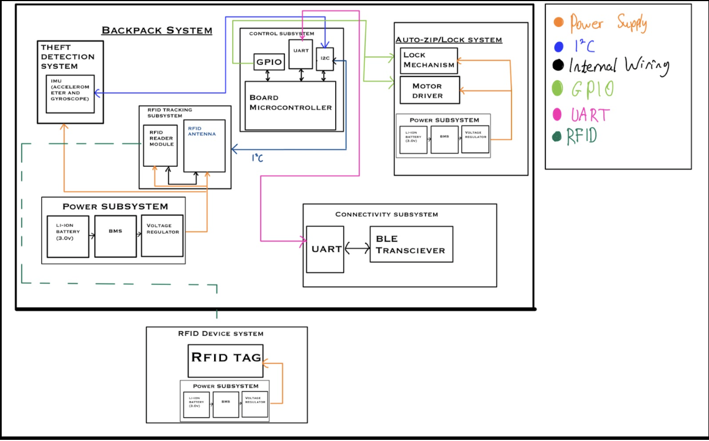
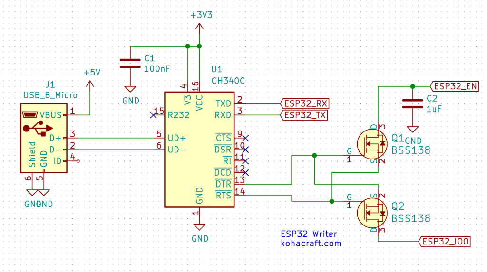

# Seth's Work Log

- [Feb. 06, 2025 - Idea Finalization](#entry0)
- [Feb. 13, 2025 - Product Expansion](#entry1)
- [Feb. 16, 2025 - Design Review Preparation](#entry2)
- [Feb. 24, 2025 - Planning PCB Design](#entry3)
- [Mar. 10, 2025 - Implementing Basic RFID](#entry4)
- [Mar. 11, 2025 - Finding Bugs in Current Implementation](#entry5)
- [Mar. 13, 2025 - Debugging PCB for Order](#entry6)
- [Apr. 06, 2025 - First PCB Order](#entry7)
- [Apr. 07, 2025 - Second PCB Order](#entry8)
- [Apr. 18, 2025 - Working on Documents](#entry9)
- [Apr. 21, 2025 - Subsystem Progress](#entry10)
- [Apr. 22, 2025 - Motor Tinkering](#entry11)
- [Apr. 25, 2025 - First Parts of the Prototype](#entry12)
- [Apr. 26, 2025 - PCB Work](#entry13)
- [Apr. 28, 2025 - Making a Prototype](#entry14)
- [Apr. 29, 2025 - Final Touches and Presentation](#entry15)

## February 06, 2025 - Idea Finalization 
After individually brainstorming, we met up as a group to pool our ideas and narrow down our options in order to complete an RFA (request for approval) for our project. We decided on a micro-controller based project that would double as a backpack item tracker to prevent losing or leaving behind the contents of one's backpack and act as an anti-theft device. This device would utilize RFID technology to keep track of items and a gyroscope based system that would be used to detect if the backpack is being moved. Criteria for Success Accurate RFID Tracking: The system must reliably detect and track RFID-tagged items in real-time, alerting users when an item is missing. 
\
\
The decided upon criterion for success:
- Effective Theft Detection: The IMU sensors should correctly identify unauthorized movements and trigger alerts or alarms.
- Seamless Mobile App Integration: The app should provide real-time inventory tracking, geofencing alerts, and security notifications.
- Reliable Auto-Zip & Locking Mechanism: The motorized zippers and locks must function consistently and respond correctly to user-defined security settings.

## February 13, 2025 - Product Expansion 
Today's focus was on the completion of a full project proposal document. We decided to go with the name "Backtracker" while also solidifying the subsystems we would be implementing: accurate RFID based item tracking, gyroscope based anti-theft measures, and an auto-zip and auto-locking mechanism. These subsystems were expanded upon what is necessary for each subsystem. This document also has a more official, in depth problem and solution statement. [Project Proposal Doc Link](https://docs.google.com/document/d/1oT1uViF3huYhxj1f5n7ijpcLWG28EtPaLmi4j_PiVDU/edit?tab=t.0)
\
\

## February 16, 2025 - Design Review Preparation 
We fleshed out some details on our design in order to present it to the TA and professor for feedback. We have narrowed down our choice of micro-controller to an ESP32 or STM32 and will need to do further analysis. We have also found potential parts for the RFID antenna: ARRUN5-915.000MHZ and MFRC52202HN1,151, of which again further analysis will be needed. We also decided to go with HF (high frequency) RFID tags and transmitter, which operate at 13.56 MHz in order to cover the necessary range to detect items in a backpack.

## February 24, 2025 - Planning PCB Design 
Our group met up and began discussing the specifics of how we were going to implement the design of each of our three subsystems. The RFID system and the accelerometer/gyroscope system seem to have a straightforward path ahead of designing the circuit since the conceptual functions have been decided upon. Most of our focus was on the automatic zipper subsystem, which seems like it will be the most difficult. We came up with a couple potential ways to implement this, however an outright zipper system may be too complicated and we may have to do automatic backpack closing via a different method.
Currently, the most promising ideas are to have a motorized spool with higher torque attached to one side of the zipper and then have the cable anchored to the other side of the zipper so that when the backpack is open and the front is folded over, the spool can pull the backpack together to make it easier to seal.
Sealing with the zipper may be hard, so we came up with the idea to use magnetic fasteners, perhaps in conjunction with a latching mechanism. However this needs to be fleshed out.
\
\
To do next time:
- Pick out specific parts
- Begin PCB design
- Design subsystem circuits
- Decide on a microcontroller

## March 10, 2025 - Implementing Basic RFID 
We worked on different parts of the project to get the basic functionality of some of our subsystems. The RFID system was original setup on an Arduino UNO for testing purposes, and once the read/write functionality was developed, the RFID antenna was rewired to connect to pins on the ESP32 microcontroller that we will be using for our final PCB. After the needed device drivers were installed, the Arduino IDE was suitable to upload the code to the ESP32. The RFID system ended up having the ability to read any RFID tag in the vicinity, and once the user input a value into the Arduino IDE terminal, the system entered write mode, which then writes the string to the next passive RFID tag that comes into the range of the antenna before going back into read only mode. This can happen for any number of passive high-frequency RFID tags.
\
\

## March 11, 2025 - Finding Bugs in Current Implementation 
After the bluetooth functionality prototype was integrated with the RFID code, the breadboard prototype was put to the test to explain some functionality, and we realized that there were some bugs that need to be fixed with the bluetooth and some functionality added to the RFID system. The bluetooth seems to run on a delay or not receive the signal when it's around other microcontrollers, and we suspect it has something to do with the bluetooth being a specific low powered version called Bluetooth Low Energy (BLE). The RFID system needs a way to become attached to different objects, we are thinking about implementing another tag and/or reader in order to also detect if the backpack is closed or open, which will be good information for our other subsytems. Plus we need to figure out where to put the RFID reader to make up for the range, because if the RFID antenna is at the bottom of the backpack, it cannot reach all the tags.

## March 13, 2025 - Debugging PCB for Order 
After my partners finished up our first PCB, we ran it through the design rule checker (DRC) and the electrical rule checker (ERC). It turns out we had many errors. So I did my best to debug all of them, and the main ones were related to the way power and ground was being labeled on the schematic, and there were multiple nets that were not connected in the PCB editor. The schematic also had some problems with unused pins. So after a couple hours of debugging, unfortunately I was not quite able to get rid of all the errors, as there were just only two left to fix but they wouldn't go away. This means we were closer to a viable PCB order, but it would not pass the PCBWay audit in time to meet that order.

## April 06, 2025 - First PCB Order 
As a group we got together to fix some of the issues present last time we tried to order out PCB, and managed to fix the power labeling issue. We also added some pull-up resistors and decoupling capacitor as directed by the schematics of some of out parts. We also fixed some clearance issues that were present on both the board and the through holes. We also ended up rerouting some of the parts to make it more space efficient.
\
\

## April 07, 2025 - Second PCB Order 
For the second PCB that we were submitting, we realized that we did not include any sort of USB or communication integration to write to the ESP32, so without that we wouldn't be able to code out microcontroller. So we decided to add some pin holes on the PCB and connect it to the ESP using the schematic below. We also decided to add pins for a servo motor so that we can figure out how to make our auto-zipping subsystem. There were a bunch more errors with the DRC like earlier, where there was a lot of mix-ups with the power and ground nets, and somehow they got switched up so a lot of the components were reversed. So we had to spend time debugging that, but eventually they passed all the necessary checks and the PCB should hopefully work when they arrive.
\
\

Source = https://en.kohacraft.com/archives/make-a-circuit-using-ch340c-for-esp32-writingsuccess.html

## April 18, 2025 - Working on Documents 
We met up today, then separately worked on some required docs for the class.

## April 21, 2025 - Subsystem Progress 
We met today and while Shreyas worked on the IMU and Bluetooth, Aashish and I worked on the RFID more. We worked on getting the code working and making progress with the part where the code tracks what was put in and what was removed. I also worked on soldering some components to the breakout bored and other items we needed to get the breadboard functioning.

## April 22, 2025 - Motor Tinkering 
We got together as a group and used our previous RFID and Bluetooth system breadboard to try and get a motor component working. We got a couple motors from one of my kits that were strong enough to pull a bag closed. We got the motor to work how we needed, but we need to figure out how to fix it to the backpack, but it does reel it in. We tried to connect it to the ESP but we were having problems outputting the ESP signal properly to activate the motor because the motor uses more voltage.

## April 25, 2025 - First Parts of the Prototype 
We started making the prototype for the backpack using our breadboard to pull the backpack closed. The other subsystems functioned well, but the motor was the trickiest. We decided to use yarn to close it, feeding it through a hole in the backpack and latch it to the flap. The problem is that the yarn would get tangled or snap frequently, so we would have to replace it a lot. I also went to ECEB to pick up smaller RFID tags to fasten to the items in the backpack.

## April 26, 2025 - PCB Work 
We went to ECEB to work in the lab as we got our most recent PCB order. We used an ESP32 and a stencil with the oven to fasten the ESP to the PCB. I also soldered the resistors, transistors, capacitors, and pins to the PCB. We also used the soldering iron to fasten pins to other parts we had, like the RFID breakout board. We also attached wires to a mini USB to UART programmer in order to program the ESP.

## April 28, 2025 - Making a Prototype 
We met up as a group today, so Aashish and I worked on putting together a full working prototype. We had an issue with the yarn snapping as the motor retracted the flap, so we went to Target and found some picture frame wire that we could use. This was stronger and more flexible than the yarn, but it still has some problems where it snags on the backpack fabric. We used duck tape to fasten the breadboard to the backpack and keep it stable. We also used a four AA battery pack that was attached to the back of the breadboard, which we then hooked up to the motor. So most of the time, the motor successfully pulled the backpack closed when the Bluetooth and if the IMU was jostled enough.

## April 29, 2025 - Final Touches and Presentation 
We prepped and gave our demo today, so we had to iron out a couple bugs in the ESP, which it turns out we burnt out. Our power source was too high in voltage so we replaced it with a portable charger and a new ESP which worked better. We also replaced the string so that it wouldn't get snagged since the other one got knotted. We were able to program it and use the Bluetooth along with the IMU to create a somewhat functional prototype. Then we went to give the mock demo.